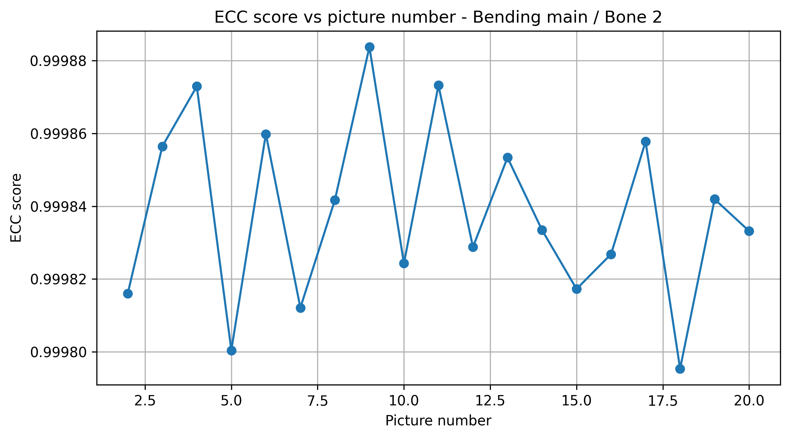
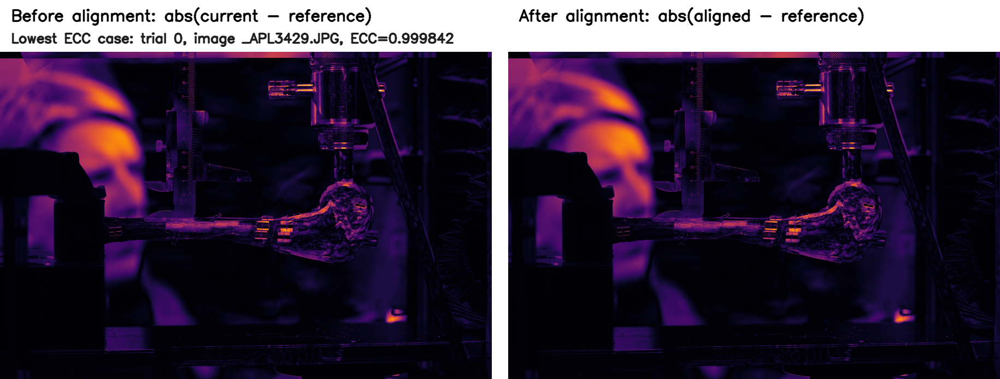

# Bending Image Alignment

This page describes the optional image-alignment stage used for the Bone 2 bending in sagittal plane example. The implementation is in `deformation_protocol.alignment`.

## Purpose

Alignment is used only for bending in sagittal plane. During bending, the image series may contain small apparent specimen motion caused by rigid in-plane translation and rotation of the camera view. The alignment step estimates this rigid in-plane transform for each image relative to the unloaded reference image of the same trial. Compression does not require this step in the repository workflow.

Marker measurement itself uses the raw trial images configured under `raw_images`; it does not automatically switch to `outputs/aligned_images`. The alignment output is provided as a documented quality-control and preprocessing stage consistent with the article workflow.

## Example Images

ECC scores for the ROI-based alignment:



Full-frame absolute-difference image for the non-reference bending image with the lowest ECC value in the example alignment manifest. The left panel shows the difference before alignment, and the right panel shows the difference after applying the rigid in-plane transform:



## Algorithm

For each trial, the first image is treated as the reference image. The same rectangular ROI is extracted from the reference and from every subsequent image in that trial. The images are converted to grayscale, optionally blurred, and registered using OpenCV enhanced correlation coefficient (ECC) optimization.

The motion model is Euclidean rigid in-plane registration, meaning translation and rotation are allowed, but scaling and shearing are not. The output transform is stored as a 2 x 3 affine matrix in `alignment_manifest.csv`. The ECC value is stored for every non-reference image. Values closer to 1 indicate stronger correspondence between the transformed current ROI and the reference ROI.

The configured acceptance threshold is `ecc_threshold = 0.99`. Images below this value are marked as `below_threshold` in the manifest. Failed registrations are marked with a failure status and the OpenCV error message.

## Alignment Command

```powershell
python -m deformation_protocol.cli align --config configs/bone2_example_config.yaml --dataset bending_in_sagittal_plane --write-images --save-roi-info --overwrite-existing
```

The command writes:

```text
outputs/aligned_images/bending_in_sagittal_plane/alignment_manifest.csv
outputs/aligned_images/bending_in_sagittal_plane/trial_*/
outputs/aligned_images/bending_in_sagittal_plane/roi_selection_output/
```

`--write-images` saves aligned images. `--save-roi-info` copies only the ROI provenance files from `example_data/Bone_2/bending_in_sagittal_plane/roi_reference/` into the alignment output. If `outputs/aligned_images/.../roi_selection_output/` already exists, the CLI asks whether to overwrite it; add `--overwrite-existing` for repeatable non-interactive runs.

## Alignment YAML Parameters

| Parameter | Meaning | Practical effect |
|---|---|---|
| `enabled` | Enables or disables alignment for the dataset. | `true` for bending in sagittal plane; `false` for compression. |
| `method` | Registration method label. | Documents that rigid ECC translation/rotation registration is used. |
| `ecc_threshold` | Minimum accepted ECC score. | Scores below this value are flagged in the manifest. |
| `ecc_iterations` | Maximum ECC optimization iterations. | Higher values allow more optimizer steps but increase runtime. |
| `ecc_epsilon` | ECC convergence tolerance. | Smaller values require tighter convergence before stopping. |
| `blur_kernel` | Gaussian blur kernel size applied before registration. | Reduces local image noise in the ROI before ECC optimization. |
| `search_margin_px` | Reserved search-margin field. | Present for provenance; the current implementation uses the fixed ROI directly. |
| `roi_xywh` | ROI rectangle as `[x, y, width, height]` in pixels. | Defines the image patch used for alignment. |
| `roi_selection_output` | Relative path to ROI provenance files. | Used only when `--save-roi-info` is set; not needed to define the ROI because `roi_xywh` is already in the config. |

## Alignment Manifest Columns

| Column | Meaning |
|---|---|
| `trial_id` | Zero-based loading-series index. |
| `load_step_id` | Zero-based image index within the trial. |
| `load` | Load value from `load_steps`. |
| `image` | Current image filename. |
| `reference_image` | Unloaded reference image for the same trial. |
| `ecc` | Enhanced correlation coefficient after registration. |
| `status` | `reference`, `ok`, `below_threshold`, or failure message. |
| `warp_00` ... `warp_12` | Elements of the 2 x 3 affine transform matrix. |


