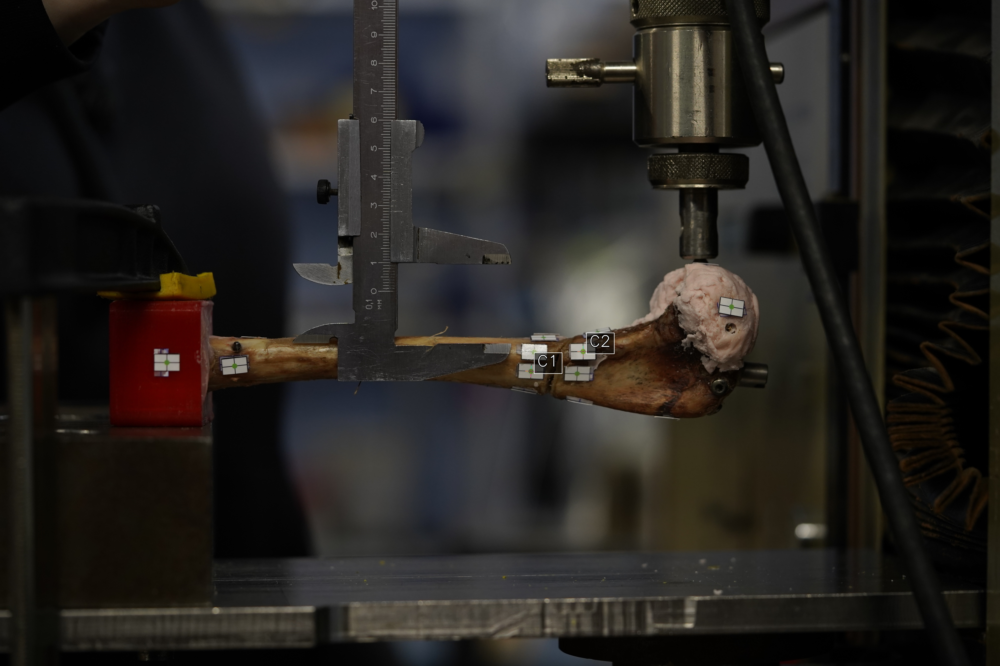
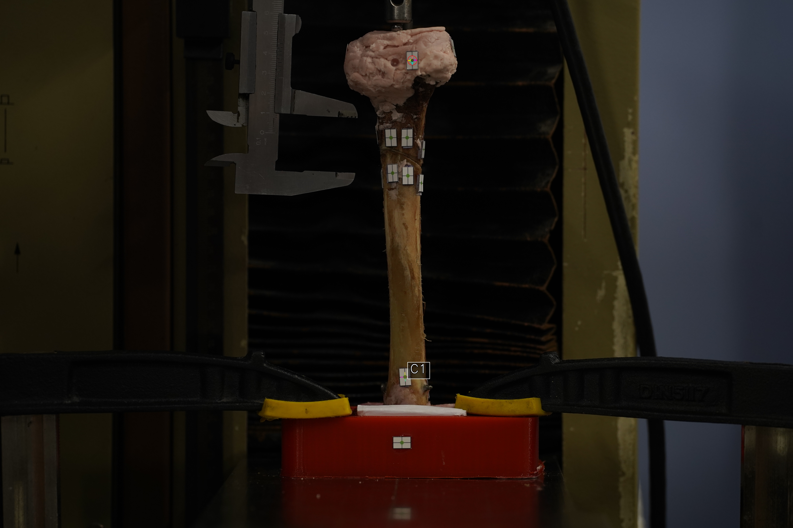

# Marker Detection And Refinement

This page describes the marker measurement stage used in the Bone 2 example. The implementation is in `deformation_protocol.marker_engine` and is called through `deformation_protocol.marker_detection`.

## Example Images

All refined markers in the first unloaded image of the bending series:

All refined markers in the first unloaded image of the compression series:

Debug image for the Fracture zone marker pair `3->5` in bending in sagittal plane:

Debug image for the Whole-bone marker pair `4->7` in compression:

## Detection Step

Marker detection provides approximate marker-center candidates. The image is converted from BGR to HSV color space, and green marker-center regions are segmented with the configured HSV interval. Morphological closing and opening are then applied to reduce small holes and isolated noise. Connected components are extracted from the binary mask, and components above the area threshold are converted into centroid coordinates.

Marker indexing is preserved across the loading series. In the first image, detected centers are sorted by image position. In subsequent images, each previous marker is matched to the nearest current detection if the displacement is smaller than `max_marker_jump`. If a marker is not detected, the previous position is retained.

## Refinement Step

Refinement converts each approximate green-center candidate into a more precise center based on the dark vertical and horizontal marker lines around the candidate. For each marker candidate, a local circular region is analysed. Dark pixels are selected using RGB intensity thresholds and local grey-level contrast. These pixels are clustered into line fragments. The algorithm then identifies two pairs of approximately parallel clusters, merges each parallel pair, fits two line equations, and calculates their intersection. This intersection is the refined marker center used for distance and deformation calculations.

If the required line structure cannot be found, the code keeps the approximate center and writes a warning when warning logging is enabled. This makes failures visible without silently changing marker indexing.

## Quality-Control Example: Isolated Refinement Warning

The compression Whole-bone marker pair `4->7` includes one warning in the first unloaded image of trial 0. In this image, one marker could not be refined from the local vertical and horizontal marker-line clusters, so the algorithm retained the approximate detected center and recorded a warning.

This warning is not critical for the deformation measurement workflow because it is isolated to trial 0. In the final deformation analysis, only trials 1-3 are used for deformation measurement. The example is intentionally retained in the repository documentation to show how the quality-control mechanism flags incomplete marker refinement instead of silently hiding it.

## Marker-Pair Deformation Calculation

For each configured marker pair, refined marker centers are extracted for every image in every trial. Pairwise displacement is calculated from the change in signed coordinate difference between the two markers. The output uses article terminology:

- `X`: deformation component normal to the load direction in this Bone 2 example.
- `Y`: deformation component in the load direction in this Bone 2 example.

For compatibility, the table keeps deformation columns relative to the unloaded image of each trial and relative to the first loaded step. The final marker-pair deformation columns are calculated separately as `Deformation_X_mm` and `Deformation_Y_mm`: signed `dX`/`dY` distances are referenced to Trial 1 at 0 N, then shifted so the mean first loaded step across trials 1-3 is zero. Trial 0 is still calculated in the per-image table, but it is excluded from mean deformation and confidence-interval statistics.

## Marker-Pair `params.yaml`

Each marker pair has its own `params.yaml` file because calibration, detection tracking, or local marker appearance may differ between loading modes or marker groups.

| Parameter | Meaning | Practical effect |
|---|---|---|
| `calibration_value_str` | Formula or string used to define the pixel/mm calibration. | Documents how the calibration value was obtained from the caliper measurement. |
| `calibration_value` | Numeric pixel/mm value. | Used to convert pixel distances into millimetres. |
| `load_arr` | Ordered list of load steps for one trial. | Defines load labels and the number of images expected per trial. |
| `circle_radius` | Radius, in pixels, around the approximate marker center used for refinement. | Larger values include more local marker-line pixels but can also include neighbouring structures. |
| `red_thresh_high` | Upper red-channel threshold for dark-pixel selection. | Helps isolate dark marker-line pixels inside the local refinement region. |
| `green_thresh_high` | Upper green-channel threshold for dark-pixel selection. | Helps isolate dark marker-line pixels inside the local refinement region. |
| `blue_thresh_high` | Upper blue-channel threshold for dark-pixel selection. | Helps isolate dark marker-line pixels inside the local refinement region. |
| `grey_delta` | Local grey-level contrast threshold. | Controls how strongly a pixel must differ from the local background to be treated as part of a dark marker line. |
| `angle_tol` | Angular tolerance, in degrees, for identifying approximately parallel line clusters. | Higher values accept more angular variation; lower values are stricter. |
| `min_cluster_size` | Minimum number of pixels required for a line cluster. | Filters out small noisy clusters during line fitting. |
| `lower_green` | Lower HSV threshold for detecting green marker-center candidates. | Controls initial marker detection sensitivity. |
| `upper_green` | Upper HSV threshold for detecting green marker-center candidates. | Controls initial marker detection sensitivity. |
| `track_previous` | Whether marker detections are matched to the previous image. | Preserves marker IDs across a loading series; useful when marker order may change visually. |
| `max_marker_jump` | Maximum allowed marker displacement, in pixels, for frame-to-frame matching. | Prevents accidental marker-ID swaps during tracking. |

## Dataset Configuration Fields Related To Marker Measurement

| Parameter | Meaning |
|---|---|
| `bone` | Name of the example specimen. |
| `figure_x` | Relative path to the article workflow figure used in the README. |
| `examples.<dataset>.label` | Human-readable article label for the loading condition. |
| `examples.<dataset>.raw_images` | Folder containing trial-separated raw images. |
| `examples.<dataset>.load_steps` | Ordered load values for one trial. |
| `examples.<dataset>.marker_pairs.<group>.label` | Article marker group name, for example `Whole-bone` or `Fracture zone`. |
| `examples.<dataset>.marker_pairs.<group>.pair` | 1-based marker IDs used for the pairwise deformation calculation. |
| `examples.<dataset>.marker_pairs.<group>.params` | Relative path to the marker-pair `params.yaml`. |
| `terminology.x_axis` | Article wording corresponding to the generic X component. |
| `terminology.y_axis` | Article wording corresponding to the generic Y component. |

The combined statistics table is generated with `python -m deformation_protocol.cli stats --config configs/bone2_example_config.yaml`. It reports mean, SD, and 95% CI for X and Y deformation components using trials 1-3 only.
